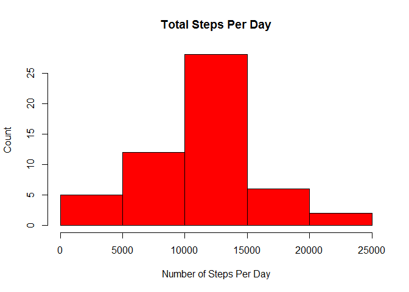
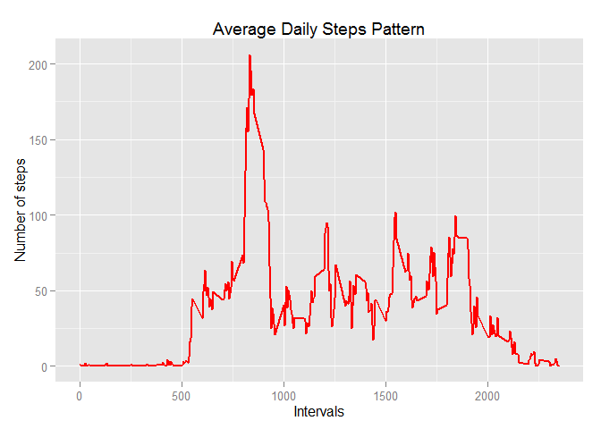
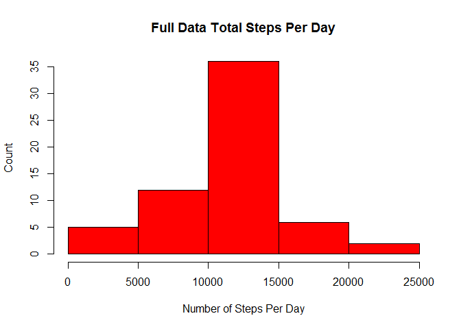
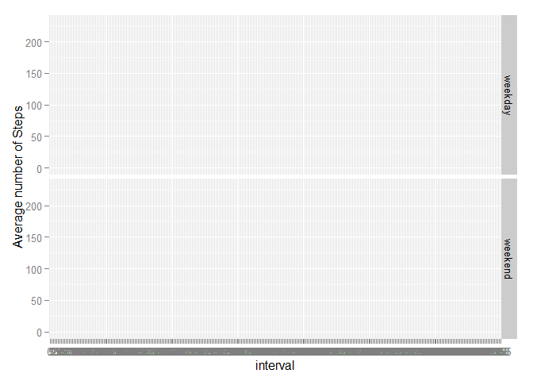

# Reproducible Research: Peer Assessment 1
Vira Yakusha  
Saturday, March 14, 2015  

Data from a personal activity monitoring device
This device collects data at 5 minute intervals throughout the day
The data consists of two monts of data from an anonymous individual collected during the months of October and November 2012
The variables included in the dataset are: steps, date, interval

The script below performs the followning steps:

###Loading necessary libraries

```r
library(knitr)
```

```
## Warning: package 'knitr' was built under R version 3.1.3
```

```r
library(dplyr)
```

```
## Warning: package 'dplyr' was built under R version 3.1.2
```

```
## 
## Attaching package: 'dplyr'
## 
## The following object is masked from 'package:stats':
## 
##     filter
## 
## The following objects are masked from 'package:base':
## 
##     intersect, setdiff, setequal, union
```

```r
library(ggplot2)
```

```
## Warning: package 'ggplot2' was built under R version 3.1.2
```

## Loading and preprocessing the data

set the working directory and read the data file

```r
setwd("~/GitHub/RepData_PeerAssessment1")
activity <- read.csv("activity.csv", header=TRUE,   sep=",", colClasses=c("numeric", "character", "numeric"))
activity$date <- as.Date(activity$date, format="%Y-%m-%d")
activity$interval <- factor(activity$interval)
```
see what we've got

```r
str(activity)
```

```
## 'data.frame':	17568 obs. of  3 variables:
##  $ steps   : num  NA NA NA NA NA NA NA NA NA NA ...
##  $ date    : Date, format: "2012-10-01" "2012-10-01" ...
##  $ interval: Factor w/ 288 levels "0","5","10","15",..: 1 2 3 4 5 6 7 8 9 10 ...
```

## What is mean total number of steps taken per day?
a. calculate number of steps for each day


```r
steps_day <- aggregate(steps ~ date, activity, sum)
colnames(steps_day) <- c("date", "steps")
```
b. display histogram

```r
hist(steps_day$steps, main="Total Steps Per Day", xlab="Number of Steps Per Day", ylab="Count", col="Red")
```

 

c. calculate mean and median for steps per day


```r
steps_mean <- mean(steps_day$steps, na.rm=TRUE)
steps_median <- median(steps_day$steps, na.rm=TRUE)
```

**Result:** The mean is **1.0766189\times 10^{4}** and the median is **1.0765\times 10^{4}** 


## What is the average daily activity pattern?

a.aggregate (mean) number of steps per each interval

```r
steps_interval <- aggregate(activity$steps, by = list(interval = activity$interval), FUN=mean, na.rm=TRUE)
```

b.convert intervals back to integers

```r
steps_interval$interval <- as.integer(levels(steps_interval$interval)[steps_interval$interval])
colnames(steps_interval) <- c("interval", "steps")
```

d.display our findings as a plot

```r
ggplot(steps_interval, aes(x=interval, y=steps)) +   
        geom_line(color="red", size=1) +  
        labs(title="Average Daily Steps Pattern", x="Intervals", y="Number of steps") 
```

 

e. Which 5-minute interval, on average across all the days in the dataset, contains the maximum number of steps? Answer:

```r
most_intense <- steps_interval[which.max(steps_interval$steps),]$interval
```
**Answer: ** on average interval number **835** is the most intense one of the day 


## Imputing missing values
Note that there are a number of days/intervals where there are missing values (coded as NA). The presence of missing days may introduce bias into some calculations or summaries of the data.

a. Calculate and report the total number of missing values in the dataset (i.e. the total number of rows with NAs)

```r
steps_missing <- sum(is.na(activity$steps))
```
**Answer:  2304** is a total number of missing values in the steps column

b. Devise a strategy for filling in all of the missing values in the dataset. The strategy does not need to be sophisticated. For example, you could use the mean/median for that day, or the mean for that 5-minute interval, etc.

**Answer:** The dataset from the previous step (mean values for each interval) will be used to fill in NA


c. Create a new dataset that is equal to the original dataset but with the missing data filled in.

```r
fill_na <- function(data, defaults) {
        na_indices <- which(is.na(data$steps))
        na_replacements <- unlist(lapply(na_indices, FUN=function(idx){
                interval = data[idx,]$interval
                defaults[defaults$interval == interval,]$steps
        }))
        fill_steps <- data$steps
        fill_steps[na_indices] <- na_replacements
        fill_steps
}

full_data <- data.frame(  
        steps = fill_na(activity, steps_interval),  
        date = activity$date,  
        interval = activity$interval)
```

d. Make a histogram of the total number of steps taken each day and Calculate and report the mean and median total number of steps taken per day. Do these values differ from the estimates from the first part of the assignment? What is the impact of imputing missing data on the estimates of the total daily number of steps?


```r
full_steps_day <- aggregate(steps ~ date, full_data, sum)
colnames(full_steps_day) <- c("date", "steps")

hist(full_steps_day$steps, main="Full Data Total Steps Per Day", xlab="Number of Steps Per Day", ylab="Count", col="Red")
```

 

```r
full_steps_mean <- mean(full_steps_day$steps, na.rm=TRUE)
full_steps_median <- median(full_steps_day$steps, na.rm=TRUE)
```

**Answer:** Raw dataset is the one with NA. Enhanced dataset is the one with NA replaced. 

Mean values: Origingal:  1.0766189\times 10^{4}  Enhanced: 1.0766189\times 10^{4} 
Median values: Original: 1.0765\times 10^{4}  Enhanced: 1.0766189\times 10^{4}

It looks like the mean remained unchanged (since we used mean to replace the missing values),
and the median increased a little


## Are there differences in activity patterns between weekdays and weekends?

a. Create a new factor variable in the dataset with two levels - "weekday" and "weekend" indicating whether a given date is a weekday or weekend day.

```r
str(full_data)
```

```
## 'data.frame':	17568 obs. of  3 variables:
##  $ steps   : num  1.717 0.3396 0.1321 0.1509 0.0755 ...
##  $ date    : Date, format: "2012-10-01" "2012-10-01" ...
##  $ interval: Factor w/ 288 levels "0","5","10","15",..: 1 2 3 4 5 6 7 8 9 10 ...
```

```r
full_data$date <- as.Date(full_data$date, "%Y-%m-%d")
full_data$weekend <- "weekday"
full_data$weekend[weekdays(full_data$date) %in% c("Saturday","Sunday")] <- "weekend"
full_data$weekend <- as.factor(full_data$weekend)

str(full_data)
```

```
## 'data.frame':	17568 obs. of  4 variables:
##  $ steps   : num  1.717 0.3396 0.1321 0.1509 0.0755 ...
##  $ date    : Date, format: "2012-10-01" "2012-10-01" ...
##  $ interval: Factor w/ 288 levels "0","5","10","15",..: 1 2 3 4 5 6 7 8 9 10 ...
##  $ weekend : Factor w/ 2 levels "weekday","weekend": 1 1 1 1 1 1 1 1 1 1 ...
```

```r
two_types_data <- full_data %.% group_by(interval, weekend) %.% summarize(avgsteps = mean(steps))
```

```
## Warning: %.% is deprecated. Please use %>%
```

```
## Warning: %.% is deprecated. Please use %>%
```

```r
str(two_types_data)
```

```
## Classes 'grouped_df', 'tbl_df', 'tbl' and 'data.frame':	576 obs. of  3 variables:
##  $ interval: Factor w/ 288 levels "0","5","10","15",..: 1 1 2 2 3 3 4 4 5 5 ...
##  $ weekend : Factor w/ 2 levels "weekday","weekend": 1 2 1 2 1 2 1 2 1 2 ...
##  $ avgsteps: num  2.2512 0.2146 0.4453 0.0425 0.1732 ...
##  - attr(*, "vars")=List of 1
##   ..$ : symbol interval
##  - attr(*, "drop")= logi TRUE
```

```r
qplot(x = interval, y = avgsteps, data = two_types_data, geom = c("line"), facets = weekend~., ylab = "Average number of Steps")
```

```
## geom_path: Each group consist of only one observation. Do you need to adjust the group aesthetic?
## geom_path: Each group consist of only one observation. Do you need to adjust the group aesthetic?
```

 

b. Make a panel plot containing a time series plot (i.e. type = "l") of the 5-minute interval (x-axis) and the average number of steps taken, averaged across all weekday days or weekend days (y-axis). See the README file in the GitHub repository to see an example of what this plot should look like using simulated data.
